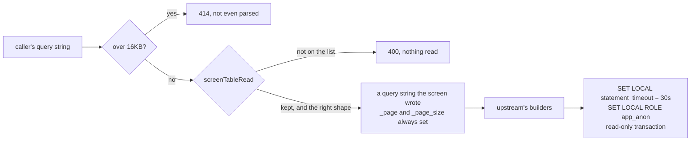

# rest's query string, reviewed

`rest` is the one door the internet reaches directly. This is the review of
everything a caller may put in the query string of a table read
(`GET /{database}/public/{table}`), taken from this tree's own code rather than
from upstream's documentation, with a verdict for each: **kept**, **kept,
restricted**, or **removed**.

It answers miniship-cloud#549. miniship-cloud#550 turns it into the
developer-facing account of the grammar; this file is that document's source of
truth, and the one to change first.

- The code is [`controllers/query_screen.go`](../../controllers/query_screen.go).
- The tests are [`controllers/query_screen_test.go`](../../controllers/query_screen_test.go)
  (every row below, as a subject), [`app/query_screen_test.go`](../../app/query_screen_test.go)
  and [`app/error_body_test.go`](../../app/error_body_test.go) (through the
  composed stack, against a `Database` that counts the connections it is given),
  and [`integration/postgres/anonymousrole/query_bounds_test.go`](../../integration/postgres/anonymousrole/query_bounds_test.go)
  (against a live Postgres).

## Why there is a wall here at all

Since miniship-cloud#546 a read runs as the `Database`'s anonymous role, inside
a read-only transaction, over `public` alone. That is the floor, and it is the
`Database`'s own grants and row security. **This review is the wall above it**,
in `rest` itself, so that a mistake in those grants is not enough to reach
anything.

pREST has closed six advisories on the read path. **Four of them are in the
table read's own query string** — in `_select`, `_count` or `_groupby` — and the
other two are next door, in the path parameters and in the `_QUERIES` template
language:

| Advisory | Where | Fixed in |
| --- | --- | --- |
| [GHSA-qvx3-q8vx-9q3c](https://github.com/prest/prest/security/advisories/GHSA-qvx3-q8vx-9q3c) (critical) | `_select`: any field containing a double-quoted run was concatenated raw | `v2.3.0` |
| [GHSA-vm7c-w4p2-6cp9](https://github.com/prest/prest/security/advisories/GHSA-vm7c-w4p2-6cp9) | `_select` beside `_count`, the second sink of the same value | `v2.3.0` |
| [GHSA-rhfr-5rf5-f2h5](https://github.com/prest/prest/security/advisories/GHSA-rhfr-5rf5-f2h5) | the same shortcut, used to redirect the `FROM` | `v2.3.0` |
| [GHSA-v9v2-98xq-627c](https://github.com/prest/prest/security/advisories/GHSA-v9v2-98xq-627c) | `_groupby` function expressions | `v2.3.x` |
| [GHSA-p46v-f2x8-qp98](https://github.com/prest/prest/security/advisories/GHSA-p46v-f2x8-qp98) (CVE-2025-58450) | path parameters | `v2.0.0` |
| [GHSA-5rwc-2hg5-2hmc](https://github.com/prest/prest/security/advisories/GHSA-5rwc-2hg5-2hmc) | `_QUERIES` template interpolation | — (route removed here, patch 4) |

Every one of them is fixed in `v2.4.2`, the tag this branch sits on. The point
of this review is not that they are unfixed; it is that **four of the six were
the same class of mistake in the same place**, each found after the last was
patched, and the fix each time was a new check inside upstream's own builder.
So the screen does not add another check inside those builders. It stands in
front of them and rebuilds the query string out of what it recognises:



**The builders never see a byte the screen did not put there.** A parameter
upstream grows in a later release is therefore refused here on the day it
appears, and served only once somebody has added it to this file and to the
switch in `query_screen.go`.

## Every parameter

`~` kept, restricted · `✗` removed. **Nothing is kept unrestricted**: every
parameter below is narrower here than upstream serves it.

### Kept

| | Parameter | What rest accepts | Why |
| --- | --- | --- | --- |
| `~` | `_select` | a comma-separated list of unqualified column names, `*`, or an aggregate written `FUNC:column[:alias]` with `FUNC` one of `SUM AVG MAX MIN STDDEV VARIANCE` | the parameter of GHSA-qvx3-q8vx-9q3c. Restricted twice over: **no dotted name**, so it cannot qualify a schema or a table, and **no quoted or parenthesised expression**, which is the shape the critical advisory used |
| `~` | `_count` | one unqualified column name, or `*` | the second sink of the same advisory. One name, because `COUNT` takes one argument; upstream accepted a list and built SQL that does not parse |
| `~` | `_count_first` | `true` | upstream acts on any non-empty value, so `_count_first=0` counted first. One spelling, so the request says what it means |
| `~` | `_distinct` | `true` or `false` | upstream acts only on the exact string `true` and silently ignores everything else, `_distinct=1` included |
| `~` | `_order` | a comma-separated list of unqualified column names, each optionally `-` for descending | no dotted name. An `ORDER BY` on an unindexed column sorts the table before the `LIMIT` applies, which is what the time limit below bounds |
| `~` | `_groupby` | a comma-separated list of unqualified column names | **the `->>having` sub-grammar and the function-expression form are removed** — see below |
| `~` | `_page` | a whole number, 1 or more | digits only, so no page number reaches the SQL as anything else. Upstream clamped a page below 1 silently; this refuses it |
| `~` | `_page_size` | a whole number, 1 or more, **capped** at the ceiling | see *The bounds* |
| `~` | a column filter, `column=value` or `column=$op.value` | `column` is one unqualified name; `$op` is one of the operators below; the value is bound as a parameter and may be anything | the value never reaches the SQL text, so `title=' OR 1=1 --` is a string to compare against and not a statement |
| `~` | a JSON filter, `column->>key:jsonb=$op.value` | `column` and `key` are both plain names | upstream already required a name for the key and escapes it by doubling quotes; with a name that doubling has nothing to do |

### The operators

**Kept**: `$eq $ne $gt $gte $lt $lte $in $nin $any $some $all $null $notnull
$true $nottrue $false $notfalse $like $ilike $nlike $nilike`.

**Removed**: `$ltreelanc $ltreerdesc $ltreematch $ltreematchtxt`, upstream's four
`ltree` operators. On an `ltree` column they are containment and match; on a
text column `~` is a **POSIX regular expression**, which is caller-supplied
backtracking against every row — and no miniship `Project` schema has an
`ltree`. The time limit would stop a bad one; not offering it is better.

The screen keeps its own list rather than reading `postgres.GetQueryOperator`,
so an operator upstream adds is refused until it is reviewed; a test holds the
list to being a **subset** of upstream's, so an operator kept here always
resolves to SQL.

**An operator must be written at the front of its value, and there may be only
one.** Upstream finds an operator anywhere in the value and strips *every*
occurrence, so `title=x $eq. y` became a filter the caller did not write, over a
value the caller did not send. The screen refuses that rather than rewriting it.

**The screen matches an operator with upstream's own expression, character for
character.** Upstream's `removeOperatorRegex` is `` `\$[a-z]+.` `` — that last
`.` is **not escaped**, so it matches any byte, a space included, and
`GetQueryOperator` then strips the `$` and the spaces. A screen that looked for
a literal `$op.` would therefore see **no operator at all** in `$ltreematch x`
and wave the value through to a builder that then applied `~` to it. That hole
was found in review, and it is why this one expression is copied rather than
rewritten: if upstream's changes, the screen's must change with it.

### Removed

| | Parameter | Why |
| --- | --- | --- |
| `✗` | `_join` | **it reached outside `public`.** `JoinByRequest` validates the joined table with `ident.IsValid`, which accepts a dotted name, and builds `INNER JOIN "pg_catalog"."pg_class" ON …`. The anonymous role may read much of the catalog, so this was a live path out of the served schema — and `rest`, not the grants, is what has to refuse it. An `App` reads one table at a time |
| `✗` | `_or` | its value is parsed by a hand-written top-level splitter that tracks quoting. The screen cannot re-derive that parse without writing a second copy of it, and **a screen that parses differently from the builder is worse than no screen** — that difference is the bug. A later ticket can restore `_or` by giving the screen and the builder one parser between them |
| `✗` | `_groupby`'s `->>having` | the `HAVING` value is interpolated into the SQL text as `'%s'` with quotes doubled by hand. Hand-escaping is the class of mistake this whole review exists for: it is correct only while `standard_conforming_strings` is on, and a `Database` can turn that off |
| `✗` | `_groupby`'s function expressions | `isSafeSQLExpression` lets thirteen named functions through with their arguments concatenated raw, and GHSA-v9v2-98xq-627c is that check's first incomplete fix. `time_bucket` is TimescaleDB's; a miniship `Project` has no use for the other twelve in a `GROUP BY` |
| `✗` | `_korder` and `column:vecdist=…` | pgvector. Their code is careful — the vector literal is rebuilt from parsed floats — but no miniship `Project` schema has a `vector` column, so the review cannot exercise them against anything, and a distance sort over 16,000 dimensions is work the page ceiling does not bound |
| `✗` | `column:tsquery=…` | full-text search interpolates the caller's value into `to_tsquery('%s')`, escaping by doubling quotes. Same reason as `->>having`, and here the caller controls the whole literal: a trailing backslash under `standard_conforming_strings = off` leaves the string unterminated |
| `✗` | `_renderer` | upstream ran every answer, error bodies included, through a JSON-to-XML converter chosen by the caller. **`rest` answers `application/json`.** The middleware's own switch is left in the tree unreached, like the handlers behind the routes patch 4 removed |
| `✗` | `_time_bucket` | TimescaleDB's, and inert in the Postgres adapter `rest` runs — `TimeBucketClause` returns an empty string there |
| `✗` | `_returning` | the write verbs', and `rest` serves none of them (patch 4) |
| `✗` | `_param`, `_header` | the `_QUERIES` template runner's, whose routes patch 4 removed |
| `✗` | `_include_system_schemas` | the catalog listings', whose routes patch 4 removed |
| `✗` | anything else | the screen is an allowlist. A name it does not know is refused, which is how a parameter upstream adds later arrives reviewed rather than served |

### Not reachable, and why it is not in the table

`_select`, `_count`, `_order`, `_groupby` and the filters are also read by
upstream's catalog handlers (`/databases`, `/schemas`, `/tables`) and by the
`_QUERIES` runner. `rest` registers neither: patch 4 leaves it two routes,
`GET /{database}/{schema}/{table}` and `GET /_health`, and `app/surface_test.go`
sends a request of every removed shape. The write verbs' body parsing
(`ParseInsertRequest`, `SetByRequest`) is unreachable for the same reason.

## The bounds

Sized from miniship-cloud's `docs/research/QUERY-BOUNDS-AND-FAIRNESS.md`, which
read eight query engines' own configuration references and source. The three
figures taken, and where each comes from:

| Bound | Value | Taken from |
| --- | --- | --- |
| page-size ceiling, `pg.max_page_size` | **5000 rows** | §1.1, Loki's `max_entries_limit_per_query`, *"log lines returned per query"*. §5 of that document counts the rows-returned family: it is the **1 of 6** engine-level scan/row limits that ships with a real, non-zero default. Everything else in the family — ClickHouse's four, Loki's pre-split byte limit — defaults to unlimited, and VictoriaLogs has none at all |
| statement time limit, `pg.statement_timeout_ms` | **30,000 ms** | §1.3 and §1.6, VictoriaLogs' `-search.maxQueryDuration` and Quickwit's `searcher.request_timeout_secs`, both **30s**. That is the tightest wall-clock default among the seven engines that publish one — Loki's is 1m, Mimir's 2m0s, CloudWatch's a fixed 60m. `rest` faces the internet, so it takes the tightest rather than the median |
| query-string length, `pg.max_query_len` | **16,384 bytes** | §1.3, VictoriaLogs' `-search.maxQueryLen`, which that document calls *"the one 'query complexity' bound expressed as a hard byte cap in this whole survey"*. **This third bound is beyond the two the ticket named**, and it is here because the review found the gap: a request line may carry a megabyte, every filter in it is a predicate built and a parameter bound, and both bounds above are downstream of that work. It answers **414** and is the only refusal that reads nothing of the query string at all |

**A page larger than the ceiling is capped, not refused**, and **a read that
asks for no page at all is given the ceiling** — upstream answered such a read
with the whole table, which was the unbounded read. A ceiling is a ceiling: a
caller who asks for less gets what they asked for.

**The time limit is set per transaction**, with `SET LOCAL statement_timeout`
inside the read-only transaction miniship-cloud#546 opens, as the login and
before `SET LOCAL ROLE`. It ends with the transaction, so the pooled connection
goes back without it. A statement that runs past it is cancelled by Postgres
(`SQLSTATE 57014`) and the answer is **504** with a message a caller can act on:

```json
{"error":"the read ran past the time limit and was cancelled; ask for fewer rows or add a filter"}
```

504 rather than 503 or 408 follows Loki's own taxonomy (§6 of the same
document): 504 for a server-side timeout, 499 for a client-cancelled request.
Setting any of the three bounds to `0` disables it; nothing miniship ships does.

## What an error answer may say

miniship-cloud#545 found pREST answering with the driver's error verbatim, **the
`Database`'s host and port included** — a read against an unreachable
`Database` returned `dial tcp 127.0.0.1:5432: connect: connection refused` to
the caller. Every error answer is now one of a fixed set. The detail goes to the
log, through `internal/logsafe`, which redacts credentials.

| What happened | Status | The answer |
| --- | --- | --- |
| the query string was longer than `pg.max_query_len` | 414 | `the query string is longer than rest reads` |
| the query string was not accepted | 400 | `query string not accepted: <the rule>`. **Nothing of the caller's is quoted back — not the value, and not the parameter's name either.** An unknown parameter is answered with the list of the ones `rest` does serve, which is more use to a developer than an echo and cannot be used to reflect bytes |
| a column that is not there (`42703`) | 400 | `no such column` |
| the anonymous role holds no grant (`42501`) | 403 | Postgres's own sentence, e.g. `permission denied for table posts`, kept by miniship-cloud#546 so the refusal is the `Database`'s and is legible |
| a table that is not there, a schema that is not `public`, a `Database` `rest` was not given (`42P01`) | 404 | `no such table` / `schema not served: …` / `database not registered: …` |
| no anonymous role, or a role that could not be entered | 500 | `could not become the anonymous role` |
| a fault of `rest`'s own, not the `Database`'s | 500 | `the read could not be completed` |
| the `Database` did not answer: refused, unreachable, closed mid-read | 502 | `the Database could not be read` |
| the statement, or the request, ran past its limit (`57014`, `context.DeadlineExceeded`) | 504 | the sentence above |

`rest`'s own 500 and the `Database`'s 502 are told apart rather than lumped
together: a network error, a bad connection or an unexpected end of file is the
`Database`'s, and everything else is `rest`'s own. That difference is whether an operator reading the
answer goes to look at the `Database` or at `rest`.

The three answers that quote the request — the schema, the `Database` alias and
the table — quote **only the caller's own path segments**, which they already
hold. No answer carries SQL text, a connection string, a host name, a port, or
the login `rest` connects with.

## What this review did not do

- **It did not re-audit the write verbs' parsing.** `rest` serves no write
  route, so `ParseInsertRequest`, `SetByRequest` and `ReturningByRequest` are
  unreachable. If a write route is ever added, they are unreviewed.
- **It did not review the `_QUERIES` template language**, for the same reason.
  GHSA-5rwc-2hg5-2hmc and GHSA-r3hj-2fxx-7f3h are both in that language.
- **It did not measure the three bounds against a miniship workload.** 5000, 30s
  and 16KB are the field's numbers, taken deliberately rather than tuned; the
  first `Project` with real traffic is what should move them.
- **It did not change `chkInvalidIdentifier`**, upstream's own permissive
  identifier check, which is still reachable from the unrouted catalog
  handlers. The screen does not rely on it.
- **It left `_or` out rather than fixing it.** Restoring it means one parser
  shared between the screen and `WhereByRequest`, which is a change to
  upstream's own builder and a rebase cost; nothing in spec
  miniship-cloud#397's user stories needs it yet.
- **It did not bound concurrency.** `docs/research/QUERY-BOUNDS-AND-FAIRNESS.md`
  §2 found the field converges on a per-tenant FIFO queue drained round-robin
  (Loki and Mimir, in near-identical words), and `rest` has nothing of the kind:
  one `Project` can occupy every connection in its own pool. The pool is
  per-`Database` and bounded (`pg.maxopenconn`), so one tenant cannot starve
  another's pool — but a tenant can starve itself, and `rest`'s own goroutines
  are unbounded. That is a ticket, not a line in this one.
